# CSNavBot: Campus Smart Navigation Bot

## Introduction
Welcome to CSNavBot, the intelligent navigation assistant designed for campus environments. Leveraging advanced algorithms and AI, CSNavBot helps users find their way across complex buildings and facilities with ease. 
It operates on a keyword-based system, providing users with a selection of options to choose from, ensuring that the keywords match the desired destination or service within the campus.

## Features
- **A* Pathfinding Algorithm**: Utilizes a custom implementation of the A* algorithm for efficient route calculation.
- **Multi-floor Navigation**: Seamlessly guides users through different floors with elevator and stair accessibility options.
- **User-friendly Interface**: Simple and intuitive UI for effortless interaction.

## Presentation Slide
[First Presentation](G5_Presentation_Slide.pdf)
 
[Second Presentation](NLP_G5.pdf)

## Infographic

## How to use
This is the main page of the CSNavBot 
 
To know more about this system, you can get more information from the proposal, presentation and infographic. 
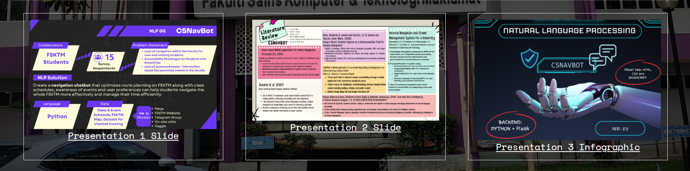 
You can also get the source code of the project from the Github 
 
To open the chatbot, click the chat box button at the bottom right. 
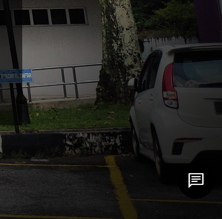 
GUI for the chatbot 
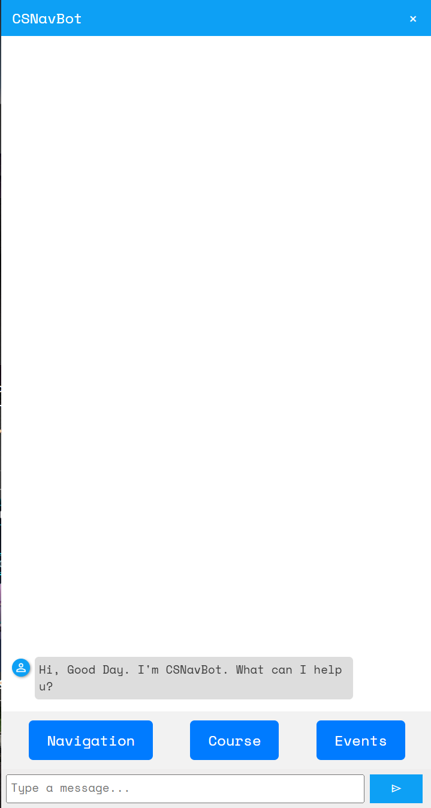 
### Navigation
After you click the `Navigation` button, list of selections of the locations will be shown.  
The location is sorted by Faculty => Block => Floor 
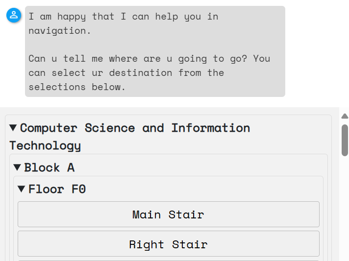 
The chatbot reply will slightly different if the mode of the user input is different. 
Case Positive: 
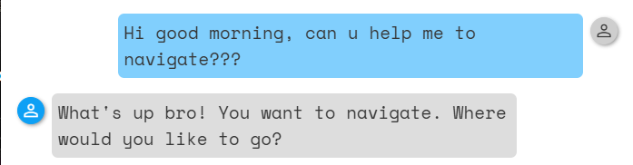 
Case Negative: 
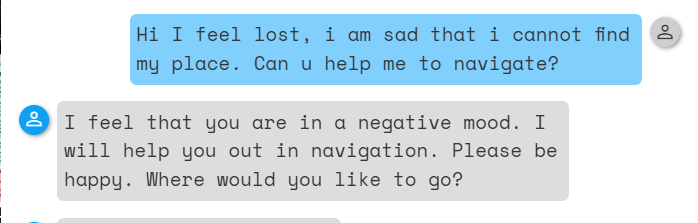 
You can filter the selections by faculty, block, floor and the room/ facilities name. 
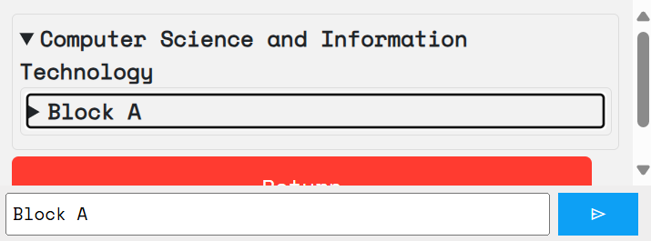 
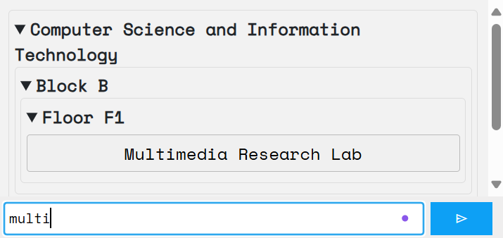 
You should enter your **destination** first, then the **start point**. 
After that, if you identify yourself as a person with a disability, then you should input `y` or `yes`, otherwise will consider as NO. 
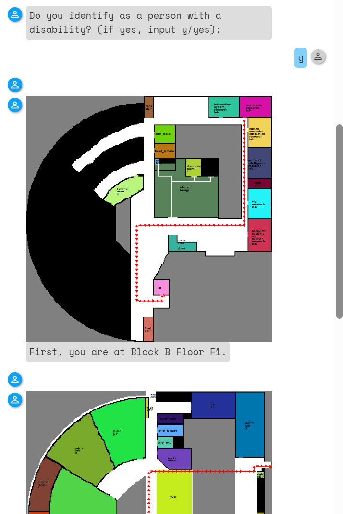 
The system will calculate the path and return image showing the path. 
It might take a while to load. During this time, the send button is disabled, so no new message can be sent. 
 
*If you will the image is too small, click the image, then the image will show in full screen.*
### Course
Below this the GUI for Course Part. List of courses selections will show. 
The courses are sorted by Faculty => Course Code => Occurrence Number 
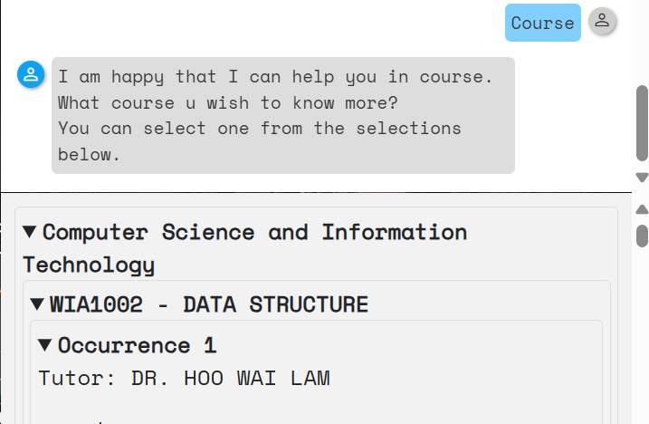 
You can also filter the selection by typing keyword in textbox. 
For example, you can search by lecturer name: 
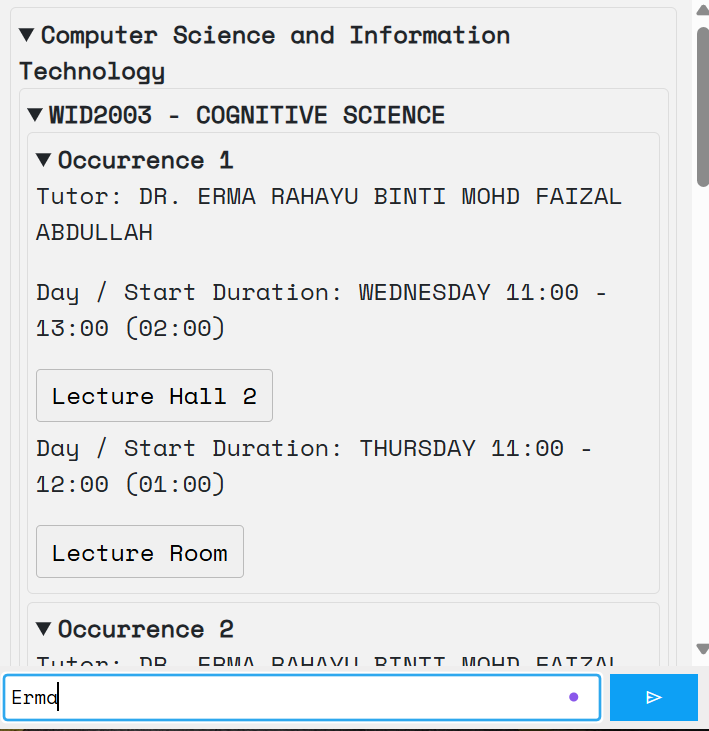 
Search by course code or course name: 
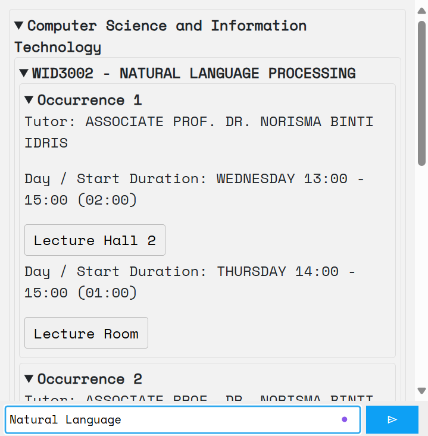 
Then the system will ask for you start point, assuming the location of course you asked is the destination you want. 
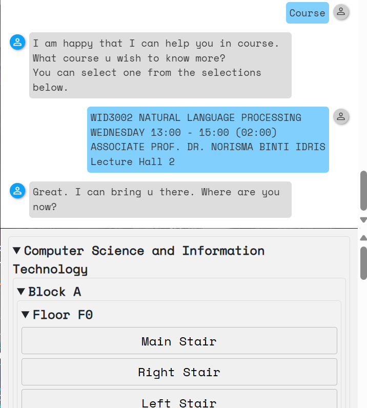 
The output is similar with navigation.
### Events
Below is the GUI of the events part. The list of events are sorted by the date and time of the events. 
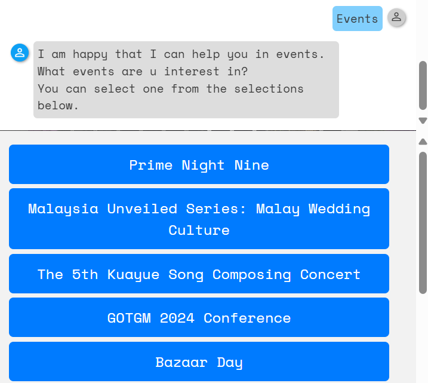 
Similarly, you can search by event name too.
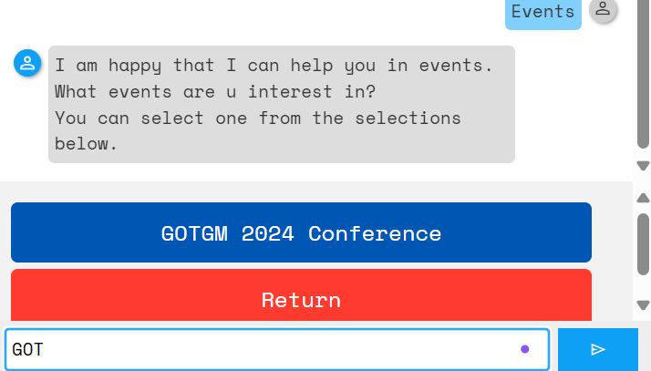 
The events details will show. 
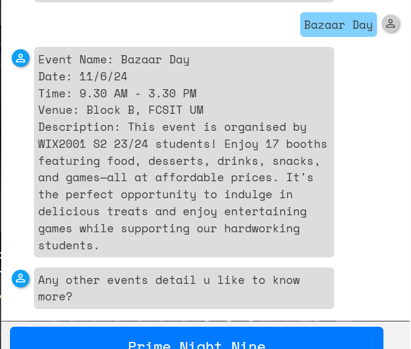 

For all the sections, there will be a `Return` button below. 
You can exit the section by clicking the button or type `return` in the text box.
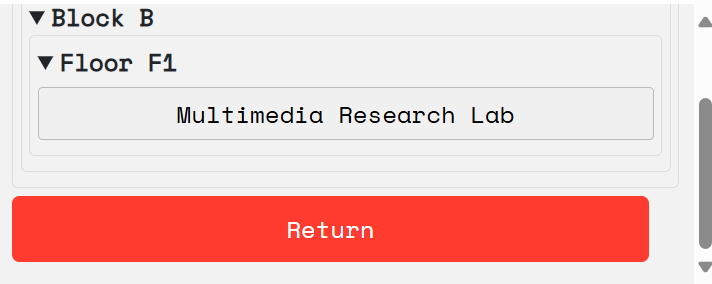