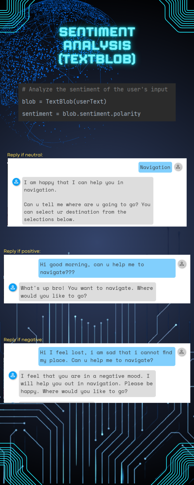

# CSNavBot: Campus Smart Navigation Bot

## Introduction
Welcome to CSNavBot, the intelligent navigation assistant designed for campus environments. Leveraging advanced algorithms and AI, CSNavBot helps users find their way across complex buildings and facilities with ease. 
It operates on a keyword-based system, providing users with a selection of options to choose from, ensuring that the keywords match the desired destination or service within the campus.

## Features
- **A* Pathfinding Algorithm**: Utilizes a custom implementation of the A* algorithm for efficient route calculation.
- **Multi-floor Navigation**: Seamlessly guides users through different floors with elevator and stair accessibility options.
- **User-friendly Interface**: Simple and intuitive UI for effortless interaction.

## Usage
To start using CSNavBot, input your desired destination and current location within the campus. The bot will calculate and display the optimal path.

## Presentation Slide
[First Presentation](G5_Presentation_Slide.pdf)
 
[Second Presentation](NLP_G5.pdf)

## Infographic

